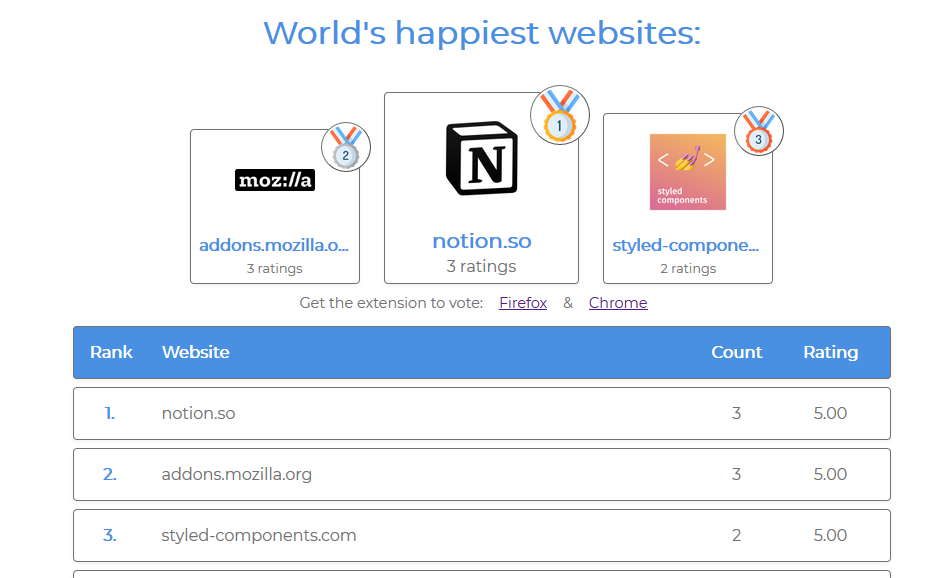

# rate-a-website

https://happiest-websites.netlify.com/

# Overview

rate-a-website is an app which shows a leader board of websites with world's happiest users. Websites user can share their happines with a website/service/product via a browser extension.
Anyone can download the [extension](https://github.com/Pav0l/rate-a-website-extension) and install it in [Firefox](https://www.notion.so/Browser-extension-356e5324ed9e47f48caf5cde6c224937#a28853f7ab3d43a0bcf3ac7c8b611977) or [Chrome](https://www.notion.so/Browser-extension-356e5324ed9e47f48caf5cde6c224937#62a3291151c9408ba55aed138870f831) browser.

## Tech stack used

The app is build using React together with Styled-components 💅 and Prop-types. I've utilized new React Hooks API to manage state inside components. Styled-components were used for styling React components and individual HTML elements. I'm also using styling based on props in the "top 3" cards. Prop-types are used for type-checking props passed to components.

HTTP are done via the [Fetch API](https://developer.mozilla.org/en-US/docs/Web/API/Fetch_API).

Every rating fetched from back end is rounded to 2 decimal places with a `roundRating` function. Also the `http/https` protocol and `www` are removed from the url string.

## Deployed website

[Happiest websites](https://happiest-websites.netlify.com/)

